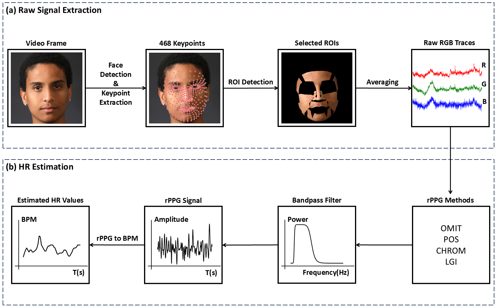
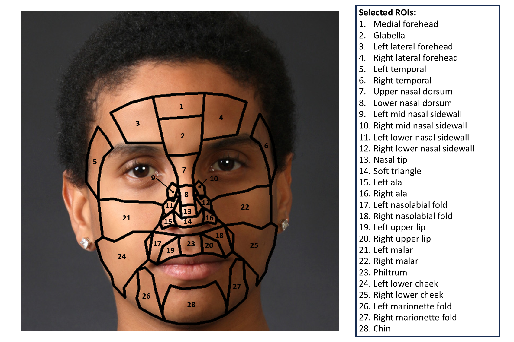

# Optimal_ROI_rPPG_Motion&Cognitive
## Introduction
This project contains the code for the systematic analysis of the optimal facial ROIs for rPPG algorithms in heart rate (HR) estimation under different subject's movements and cognitive tasks. It is a part of the research project (24ECTS) in BHMT group of D-HEST, ETH Zurich.  


### Summary
This project mainly comprises three parts:
1. Transforming facial video signals into HR values. 28 facial ROIs are defined.
2. Examinining the influence of subject's motion on ROI performance.
3. Examinining the influence of cognitie tasks on ROI performance.
### Main Contributions
1. Based on the LGI-PPGI, UBFC-rPPG, and UBFC-Phys datasets, we reorganized them into two mixed datasets: motion and cognigtive datasets.
2. We compared the performance of 28 facial ROIs under different motion types (rotation, gym, talk, speech).
3. We compared the performance of 28 facial ROIs under different cognitive tasks (game, arithmetic).
4. We proposed the utilization of glabella as the preferred facial ROI. In contrast to forehead and cheek that are more commonly employed, our findings indicate that glabella demonstrates a performance level at least on par with these regions and a better robustness in complex environments.
## Package Requirements
- dtaidistance==2.3.10   
- matplotlib==3.5.3  
- mediapipe==0.9.0.1  
- numpy==1.20.3  
- opencv_contrib_python==3.4.11.45  
- opencv_python==4.7.0.72  
- opencv_python_headless==4.5.3.56  
- pandas==1.3.5  
- pyVHR==2.0  
- PyYAML==6.0.1  
- scikit_learn==1.0.2  
- scipy==1.7.3  
- seaborn==0.11.1  
- statsmodels==0.12.2  
- tqdm==4.61.1  
- ~atplotlib==3.3.4
## Configuration
The experiments were runned on the author's personal laptop. The configurations are provided as the reference:
- CPU: AMD Ryzen 9 5900HX with Radeon Graphics
- GPU: NVIDIA GeForce RTX 3080 Laptop GPU
- CUDA Version: 11.7
- Operating System: Microsoft Windows 11 (version-10.0.22621)
## Code Structure
```bash
optimal_roi_rppg  
├─ config
│    └─ options.yaml  
├─ data
│    ├─ LGI-PPGI
│    │    ├─ hr
│    │    └─ rgb
│    ├─ UBFC-Phys
│    │    ├─ hr
│    │    └─ rgb
│    ├─ UBFC-rPPG
│    │    ├─ hr
│    │    └─ rgb
├─ main
│    ├─ main_evaluation.py
│    ├─ main_extract_rgb.py
│    ├─ main_gen_gtHR.py
│    └─ main_rgb2hr.py
├─ result
│    ├─ LGI-PPGI
│    │    ├─ evaluation_CHROM.csv
│    │    ├─ evaluation_LGI.csv
│    │    ├─ evaluation_OMIT.csv
│    │    └─ evaluation_POS.csv
│    ├─ UBFC-Phys
│    │    ├─ evaluation_CHROM.csv
│    │    ├─ evaluation_LGI.csv
│    │    ├─ evaluation_OMIT.csv
│    │    └─ evaluation_POS.csv
│    └─ UBFC-rPPG
│           ├─ evaluation_CHROM.csv
│           ├─ evaluation_LGI.csv
│           ├─ evaluation_OMIT.csv
│           └─ evaluation_POS.csv
├─ util
│    └─ util_pre_analysis.py
└─ visualization
       ├─ main_motion_stackbar.py
       ├─ main_cognitive_stackbar.py
       ├─ main_motion_violinplot.py
       ├─ main_cognitive_violinplot.py
       ├─ main_motion_baplot.py
       ├─ main_cognitive_baplot.py
       ├─ main_motion_accrate.py
       ├─ main_cognitive_accrate.py
       └─ main_linechart_accrate.py
```
## Datasets
1. UBFC-rPPG: https://sites.google.com/view/ybenezeth/ubfcrppg
2. UBFC-Phys: https://sites.google.com/view/ybenezeth/ubfc-phys and https://ieee-dataport.org/open-access/ubfc-phys-2
3. LGI-PPGI: https://github.com/partofthestars/LGI-PPGI-DB
## Usage
First, activate the local environment and then set the folder containing this README file as the current folder.  
For Windows, execute: **python (...).py**  
For Linux, execute: **python3 (...).py**  
1. Transform facial videos into raw RGB traces: **python "./main/main_extract_rgb.py"**
2. Transform raw RGB traces into BVP and HR values: **python "./main/main_rgb2hr.py"**
3. Generate ground truth heart rate values for UBFC-Phys dataset: **python "./main/main_gen_gtHR.py"**
4. Evaluate the performance of different facial ROIs on selected datasets: **python "./main/main_evaluation.py"**
5. Compare the ROI performance using overall evaluation score (OS) on the motion dataset: **python "./visualization/main_motion_stackbar.py"**
6. Compare the ROI performance using overall evaluation score (OS) on the cognitive dataset: **python "./visualization/main_cognitive_stackbar.py"**
7. Compare the ROI performance using individual evaluation metrics on the motion dataset: **python "./visualization/main_motion_violinplot.py"**
8. Compare the ROI performance using individual evaluation metrics on the cognitive dataset: **python "./visualization/main_cognitive_violinplot.py"**
9. Visualize the Bland-Altman plot of the selected ROI on the motion dataset: **python "./visualization/main_motion_baplot.py"**
10. Visualize the Bland-Altman plot of the selected ROI on the cognitive dataset: **python "./visualization/main_cognitive_baplot.py"**
11. Compute the acceptance rates of different ROIs on the motion dataset: **python "./visualization/main_motion_accrate.py"**
12. Compute the acceptance rates of different ROIs on the cognitive dataset: **python "./visualization/main_cognitive_accrate.py"**
13. Visualize the linechart to compare the acceptance rates between different ROIs: **python "./visualization/main_linechart_accrate.py"**
### Contact
If you have any questions, please feel free to contact me through email (shuoli199909@outlook.com)!
## Authors and acknowledgment
This research project was supervised by Dr. Mohamed Elgendi and Prof. Dr. Carlo Menon. The code was developed by Shuo Li. Also thank to all of the BMHT members and providers of datasets for the continuous help!
## License - MIT License.
